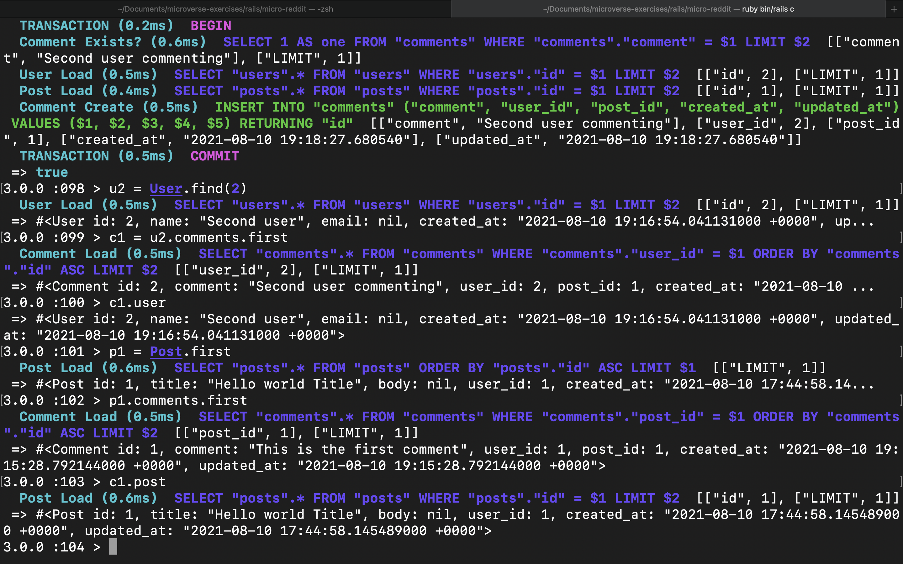
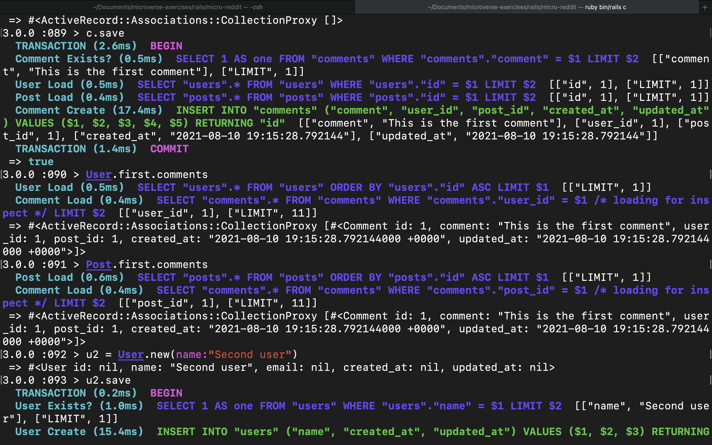
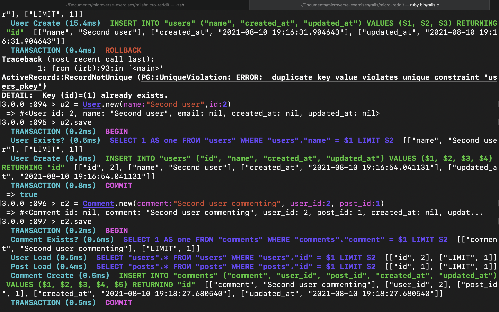

# Project Name

> This is a junior version of . This project contains build the data structures necessary to support link submissions and commenting. It does not have any front-end, thus there is no live version for this app. However the user can use the Rails console to play around with models without the overhead of making HTTP requests and involving controllers or views.

## Built With

- Ruby
- Ruby On Rails

## Getting Started

To get a local copy up and running follow these simple example steps:

### Prerequisites

- Install [Ruby](https://www.ruby-lang.org/en/)
- Get [Rails](https://rubyonrails.org/)

### Setup

- To get a local copy of the project open terminal
- run `git clone https://github.com/uzairali19/micro-reddit.git`
- Then run `cd micro-reddit`

### Usage

- To use the app on local machine make sure you are on the root directory `micro-reddit`
- Open terminal and run `bundle install` to install all the dependecies then run `rails console`
- Now you can play around with relational tables and see how it works.

### Run tests

- To register a new user `<your-varibale-name> = User.new(your_attributes_here)`
- To save the user `<your-varibale-name>.save`
- To register a new post `<your-varibale-name> = Post.new(your_attributes_here)`
- To save the post `<your-varibale-name>.save`
- To register a new comment `<your-varibale-name> = Comment.new(your_attributes_here)`
- To save the comment `<your-varibale-name>.save`

## Authors

👤 **Uzair Ali**

- GitHub: [@githubhandle](https://github.com/uzairali19)
- Twitter: [@twitterhandle](https://twitter.com/Uzairali751)
- LinkedIn: [LinkedIn](https://www.linkedin.com/in/uzairali19/)

## 🤝 Contributing

Contributions, issues, and feature requests are welcome!

Feel free to check the [issues page](https://github.com/uzairali19/micro-reddit/issues/).

## Show your support

Give a ⭐️ if you like this project!

## Acknowledgments

- This project and details are available on the Odin Project, Be sure to check that out.

## 📝 License

This project is [MIT](./MIT.md) licensed.
